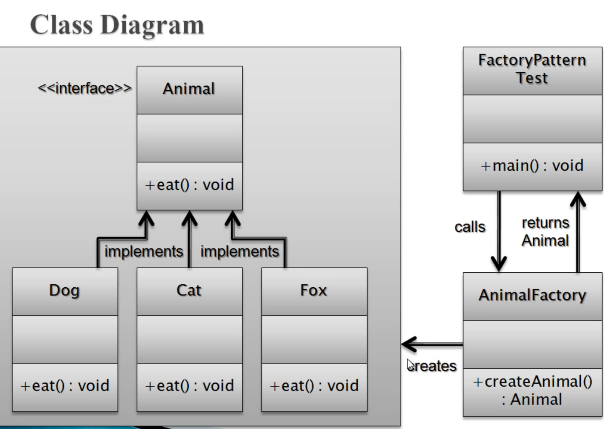
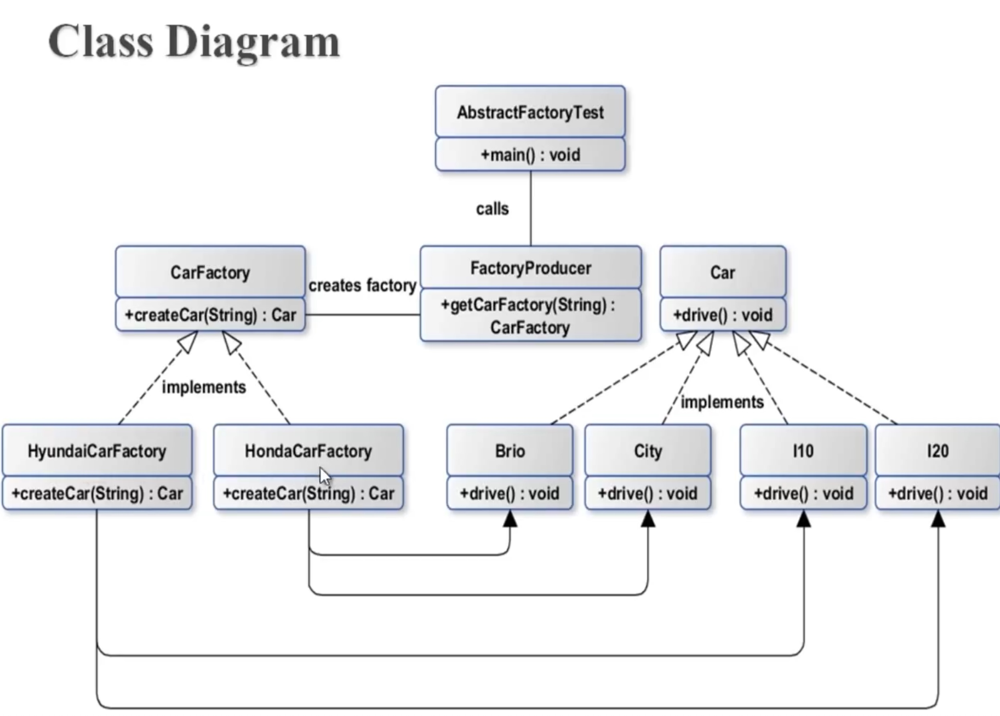

# ABSTRACT-Factrory-Desgin-Pattern
Just Demonstrate Desgin principle (SOLID) with Desgin Pattern




```java


package com.brajesh.solid.srp_fix_with_ocp.FactoryPattern.AbstractFactoryDesignPattern;
public interface Car {
    void drive();
}
package com.brajesh.solid.srp_fix_with_ocp.FactoryPattern.AbstractFactoryDesignPattern;

public interface CarFactory {

    Car createCar(CarType carType);
}

package com.brajesh.solid.srp_fix_with_ocp.FactoryPattern.AbstractFactoryDesignPattern;

public class Brio implements Car{
    @Override
    public void drive() {
        System.out.println("Driving Brio ...");
    }
}
package com.brajesh.solid.srp_fix_with_ocp.FactoryPattern.AbstractFactoryDesignPattern;

public class City implements Car{
    @Override
    public void drive() {
        System.out.println("Driving City ... ");
    }
}

package com.brajesh.solid.srp_fix_with_ocp.FactoryPattern.AbstractFactoryDesignPattern;

public class I10 implements Car{
    @Override
    public void drive() {
        System.out.println("Driving I10 ... ");
    }
}

package com.brajesh.solid.srp_fix_with_ocp.FactoryPattern.AbstractFactoryDesignPattern;

public class I20 implements Car{
    @Override
    public void drive() {
        System.out.println("Driving I20 ...");
    }
}

package com.brajesh.solid.srp_fix_with_ocp.FactoryPattern.AbstractFactoryDesignPattern;

import java.util.Map;
i
import java.util.function.Supplier;

import static java.util.Optional.ofNullable;

public class HondaCarFactory implements CarFactory {

    private static final Map<CarType, Supplier<Car>> REGISTRY =
            Map.of(
                    CarType.BRIO, Brio::new,
                    CarType.CITY, City::new
            );

    @Override
    public Car createCar(CarType carType) {
        return ofNullable(REGISTRY.get(carType))
                .map(Supplier::get)
                .orElseThrow(() -> new IllegalArgumentException("Unknown Honda car type: " + carType));
    }


}
package com.brajesh.solid.srp_fix_with_ocp.FactoryPattern.AbstractFactoryDesignPattern;

import java.util.Map;
import java.util.function.Supplier;

import static java.util.Optional.ofNullable;

public class HyundaiCarFactory implements CarFactory {

    private static final Map<CarType, Supplier<Car>> REGISTRY = Map.of(
            CarType.I10, I10::new,
            CarType.I20, I20::new);

    @Override
    public Car createCar(CarType carType) {
        return ofNullable(REGISTRY.get(carType))
                .map(Supplier::get)
                .orElseThrow(() -> new IllegalArgumentException("Unknown Hyundai car type:" + carType));
    }
}
package com.brajesh.solid.srp_fix_with_ocp.FactoryPattern.AbstractFactoryDesignPattern;

import java.util.Map;
import java.util.function.Supplier;

import static java.util.Optional.ofNullable;

public class FactoryProducer {

    private static final Map<FactoryType, Supplier<CarFactory>> REGISTRY = Map.of(

            FactoryType.HONDA_CAR_FACTORY, HondaCarFactory::new,
            FactoryType.HYUNDAI_CAR_FACTORY, HyundaiCarFactory::new
    );

    public static CarFactory getCarFactory(FactoryType factoryType) {
        return ofNullable(REGISTRY.get(factoryType))
                .map(Supplier::get)
                .orElseThrow(() -> new IllegalArgumentException("Illegal factory found :" + factoryType));
    }
}
package com.brajesh.solid.srp_fix_with_ocp.FactoryPattern.AbstractFactoryDesignPattern;

public class AbstractFactoryTest {

    static void main() {
        CarFactory hondaCarFactory = FactoryProducer.getCarFactory(FactoryType.HONDA_CAR_FACTORY);
        Car brio = hondaCarFactory.createCar(CarType.BRIO);
        brio.drive();
        Car city = hondaCarFactory.createCar(CarType.CITY);
        city.drive();
        CarFactory hyudaiCarFactory = FactoryProducer.getCarFactory(FactoryType.HYUNDAI_CAR_FACTORY);
        Car i10 = hyudaiCarFactory.createCar(CarType.I10);
        i10.drive();
        Car i20 = hyudaiCarFactory.createCar(CarType.I20);
        i20.drive();
    }
}
package com.brajesh.solid.srp_fix_with_ocp.FactoryPattern.AbstractFactoryDesignPattern;

public enum CarType {

    BRIO, CITY, I10, I20
}
package com.brajesh.solid.srp_fix_with_ocp.FactoryPattern.AbstractFactoryDesignPattern;

public enum FactoryType {
    HONDA_CAR_FACTORY, HYUNDAI_CAR_FACTORY
}


